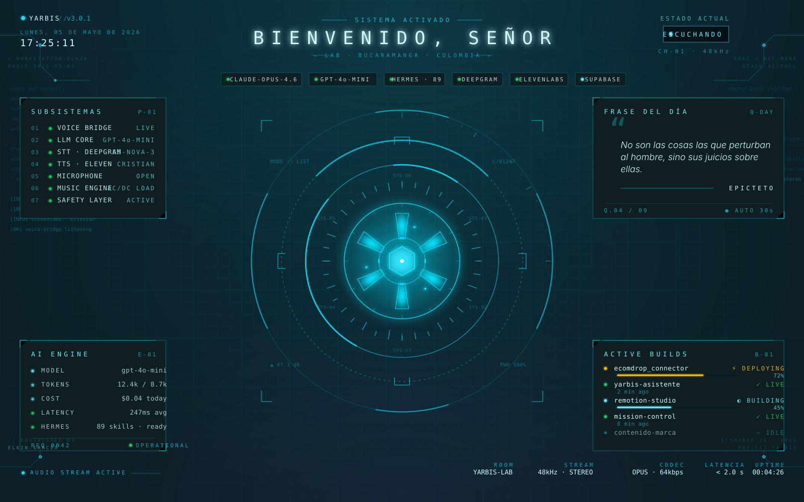

<div align="center">



# YARBIS

### Your AI Real-time Builder Intelligence System

**Un asistente de voz tipo JARVIS, open source, para builders de IA.**
Voz en tiempo real. HUD personalizado. Siempre escuchando. 100% local.


[Características](#-características) · [Demo](#-demo) · [Inicio Rápido](#-inicio-rápido) · [Comandos de Voz](#️-comandos-de-voz) · [Arquitectura](#️-arquitectura)

</div>

---

## ✨ Características

🎙️ **Conversación por voz en tiempo real** en español colombiano (o cualquier idioma) — hablas, te responde.
🎬 **HUD estilo Iron Man** con anillos rotando, arc reactor reactivo al audio, telemetría en vivo.
🌅 **Ritual matutino** — di *"Yarbis, buenos días"* y YARBIS reproduce AC/DC + entrega un saludo estoico de 150 palabras.
🛠️ **17 herramientas de voz integradas** — abre apps, navega proyectos, busca en internet, controla el Mac.
🧠 **Integración con Hermes** — delega tareas complejas (emails, calendario, GitHub, Notion) vía 89+ skills MCP.
🪟 **Siempre escuchando** — cierra la ventana, YARBIS sigue trabajando en background.
⚡ **Auto-arranque al login** (opcional) — boot completo del lab vía macOS launchd.
🔓 **Self-hosted total** — tus datos, tu máquina, tus keys. Sin dependencias SaaS.

## 🎬 Demo

> Mira el video demo en [@elkingarcia.ia](https://instagram.com/elkingarcia.ia)
>
> La imagen del header muestra el HUD real corriendo. Cuando hablas, los anillos rotan, el reactor pulsa con tu voz, y el panel de estado cambia de color según el modo (escuchando · pensando · respondiendo).

## 📦 Stack

| Capa | Tecnología |
|---|---|
| **UI** | Next.js 16 (App Router) · Tailwind v4 · Three.js · React 19 |
| **Shell nativo** | Electron 33 (autoplay habilitado, micro auto-grant) |
| **Loop de voz** | LiveKit Agents 1.5 · Silero VAD |
| **STT** | Deepgram Nova-3 (multilingüe) |
| **TTS** | ElevenLabs (voz Cristian, español colombiano) |
| **LLM (voz)** | OpenAI `gpt-4o-mini` (o `gpt-5-mini` para razonamiento) |
| **Cerebro (delegación)** | [Hermes Agent](https://hermes-agent.nousresearch.com/) por Nous Research — 89+ skills, MCP, memoria persistente |
| **Tipografía** | JetBrains Mono · Inter · Orbitron (wordmark sci-fi) |
| **Auto-arranque** | macOS `launchd` |

## 🚀 Inicio Rápido

### Prerrequisitos

- **macOS** (Apple Silicon recomendado; funciona en Intel)
- **Node 20+** y **pnpm** (`npm i -g pnpm`)
- **Python 3.11** (auto-instalado vía `uv` cuando instalas Hermes)
- **Homebrew** (`/bin/bash -c "$(curl -fsSL https://raw.githubusercontent.com/Homebrew/install/HEAD/install.sh)"`)
- **API keys**:
  - OpenAI ([obtén una](https://platform.openai.com/api-keys)) — requerida
  - Deepgram ([obtén una](https://console.deepgram.com/signup)) — requerida, tier gratis cubre ~45k min
  - ElevenLabs ([obtén una](https://elevenlabs.io/app/settings/api-keys)) — requerida, tier gratis cubre ~10k chars/mes
  - Brave Search ([obtén una](https://api.search.brave.com/app/keys)) — opcional, para el comando `search_web`

### Instalación (5 comandos)

```bash
# 1. Clona el repo
git clone https://github.com/<tu-usuario>/yarbis-asistente.git
cd yarbis-asistente

# 2. Ejecuta el instalador (instala Hermes, LiveKit, voice-bridge venv)
bash scripts/install.sh

# 3. Copia y completa tus API keys
cp .env.example .env
nano .env   # pega tu OPENAI_API_KEY, DEEPGRAM_API_KEY, ELEVENLABS_API_KEY

# 4. Instala dependencias del UI
cd ui && pnpm install && cd ..

# 5. Instala dependencias de Electron
cd electron && npm install && cd ..
```

### Arranca el stack

```bash
bash scripts/dev_all.sh
```

Listo. Esto abre **5 paneles de Terminal** en orden:

1. **LiveKit Server** (infraestructura de audio, puerto 7880)
2. **Hermes Gateway** (cerebro, puerto 8642 — solo si Hermes está instalado)
3. **YARBIS Voice (worker)** — agente Python, auto-recarga al editar
4. **YARBIS UI (Next.js)** — puerto 3000
5. **YARBIS Electron** — espera al UI, luego abre la ventana JARVIS

**La primera vez** que se abre la ventana de Electron, macOS te pide permiso para el micrófono. **Acéptalo.**

Unos segundos después, YARBIS te saluda con AC/DC + un saludo estoico (asumiendo que descargaste el audio — ver [Setup](docs/SETUP.md#5-welcome-music)).

### Verifica que todo funciona

```bash
bash scripts/healthcheck.sh
```

Deberías ver **6 de 6** servicios OK.

### Detener todo

```bash
bash scripts/stop_yarbis.sh
```

## 🎙️ Comandos de Voz

YARBIS responde a lenguaje natural en español o inglés. Algunos ejemplos:

```
"Yarbis, buenos días"           → AC/DC + saludo estoico + pantalla completa
"Yarbis, qué hora es"           → Te dice la fecha y hora
"Yarbis, abre Cursor"           → Lanza Cursor
"Yarbis, qué proyectos tengo"   → Lista repos en ~/projects/ecomdrop/
"Yarbis, cómo va el connector"  → git status del proyecto
"Yarbis, busca X en internet"   → Brave Search
"Yarbis, ocúltate"              → Esconde la ventana (mic sigue activo)
"Yarbis, modo cinema"           → Pantalla completa
"Yarbis, qué emails tengo"      → Delega a Hermes (Gmail MCP)
"Yarbis, apaga la música"       → Detiene AC/DC
```

**[→ Referencia completa de comandos](docs/VOICE_COMMANDS.md)** (17 herramientas)

## 🏗️ Arquitectura

```
┌────────────────────────────────────────────────────────────────┐
│                    Mac Mini / MacBook                          │
│                                                                │
│   ┌─────────────────────────────────────────────────────┐     │
│   │  Ventana Electron (autoplay + micro auto-grant)     │     │
│   │  carga → Next.js UI (HUD) → cliente LiveKit         │     │
│   └────────────────────┬────────────────────────────────┘     │
│                        │ WebRTC (mic sube, voz baja)          │
│                        ▼                                       │
│   ┌─────────────────────────────────────────────────────┐     │
│   │  LiveKit Server (self-hosted, puerto 7880)          │     │
│   └────────────────────┬────────────────────────────────┘     │
│                        │                                       │
│                        ▼                                       │
│   ┌─────────────────────────────────────────────────────┐     │
│   │  Voice-bridge (Python, LiveKit Agents 1.5)          │     │
│   │   ┌───────┐  ┌──────────┐  ┌────────┐  ┌─────────┐ │     │
│   │   │Silero │→ │Deepgram  │→ │OpenAI  │→ │Eleven   │ │     │
│   │   │VAD    │  │STT (es)  │  │gpt-4o  │  │Labs TTS │ │     │
│   │   └───────┘  └──────────┘  └────────┘  └─────────┘ │     │
│   │             ┌──────────────────────────────┐        │     │
│   │             │ 17 function tools            │        │     │
│   │             │ (open_app, search, project…) │        │     │
│   │             └──────────────────────────────┘        │     │
│   └────────────────────┬────────────────────────────────┘     │
│                        │ HTTP (cuando se llama ask_hermes)    │
│                        ▼                                       │
│   ┌─────────────────────────────────────────────────────┐     │
│   │  Hermes Gateway API (compatible OpenAI, puerto 8642)│     │
│   │  → 89+ skills · MCPs · memoria persistente          │     │
│   │     Gmail · Calendar · Notion · Supabase · GitHub   │     │
│   └─────────────────────────────────────────────────────┘     │
└────────────────────────────────────────────────────────────────┘
```

**[→ Documento completo de arquitectura](ARCHITECTURE.md)**

## 📂 Estructura del Proyecto

```
yarbis-asistente/
├── ui/                 # HUD Next.js (la parte visual)
│   └── src/
│       ├── app/        # Páginas, layout, globals.css
│       └── components/ # ArcReactor, HudFrame, AudioOrbit, AiEngine, BuildActivity, …
├── voice-bridge/       # Worker Python LiveKit Agents (el loop de voz)
│   ├── main.py         # Entrypoint, setup del agent, system prompt
│   ├── tools.py        # Tools core (welcome_ritual, música, apps)
│   ├── tools_advanced.py   # Búsqueda web, project ops, delegación a Hermes
│   └── assets/         # Música de bienvenida (descargada vía yt-dlp, gitignored)
├── electron/           # Shell nativo (autoplay + micro auto-grant + control de ventana)
│   ├── main.js
│   └── preload.js
├── scripts/            # dev_all.sh, stop_yarbis.sh, healthcheck.sh, install.sh, launchd plist
├── hermes/             # Personalidad + contexto de Hermes Agent
├── docs/               # Guías detalladas (SETUP, VOICE_COMMANDS, TROUBLESHOOTING, roadmap, …)
├── .env.example        # Copia a .env, completa keys
├── livekit.yaml        # Config de LiveKit Server
├── ARCHITECTURE.md
└── README.md
```

## 🔁 Auto-arranque al login (opcional)

Cuando estés cómodo con el setup, puedes hacer que todo el stack arranque automáticamente cuando inicias sesión en tu Mac:

```bash
mkdir -p ~/Library/LaunchAgents ~/Library/Logs/yarbis
cp scripts/launchd/com.ecomdrop.yarbis.plist ~/Library/LaunchAgents/
launchctl load ~/Library/LaunchAgents/com.ecomdrop.yarbis.plist
```

Para desinstalar:

```bash
launchctl unload ~/Library/LaunchAgents/com.ecomdrop.yarbis.plist
rm ~/Library/LaunchAgents/com.ecomdrop.yarbis.plist
```

## 💰 Costo estimado (uso hobbyista)

Para un día típico de interacciones por voz (50-100 turnos):

| Servicio | Costo |
|---|---|
| OpenAI `gpt-4o-mini` | ~$0.05 / día |
| Deepgram STT | tier gratis lo cubre |
| ElevenLabs TTS | tier gratis lo cubre (o ~$5/mes si lo usas mucho) |
| Hermes Gateway | $0 (self-hosted) |
| LiveKit Server | $0 (self-hosted) |
| **Total** | **~$5-15 / mes** |

## 🤝 Contribuir

PRs son bienvenidos. Antes de enviar:

1. Lee [`CONTRIBUTING.md`](CONTRIBUTING.md)
2. Prueba el cambio con `bash scripts/healthcheck.sh`
3. Asegúrate de que el build esté limpio: `cd ui && pnpm build`

## 🐛 Solución de Problemas

**[→ Ver TROUBLESHOOTING.md](docs/TROUBLESHOOTING.md)** para problemas comunes:

- "YARBIS no me escucha" → permisos del micro, AEC warmup, ducking de música
- "Caché atascado tras editar" → reset del cache de Turbopack
- "Errores 401 de adaptive interruption" → inofensivos, fallback a VAD funciona

## 📜 Licencia

[MIT](LICENSE) © 2026 Elkin Garcia · Ecomdrop IA Solutions

El audio del ritual de bienvenida (AC/DC) **NO** está cubierto por esta licencia — los usuarios deben descargar su propia copia vía `yt-dlp` para uso personal.

## 🙏 Créditos

Construido con:

- [LiveKit](https://livekit.io/) — infraestructura de audio en tiempo real
- [Hermes Agent](https://hermes-agent.nousresearch.com/) por [Nous Research](https://nousresearch.com/)
- [Deepgram](https://deepgram.com/) · [ElevenLabs](https://elevenlabs.io/) · [OpenAI](https://openai.com/)
- [Claude Code](https://claude.ai/code) · [Cursor](https://cursor.com)

Inspirado en JARVIS de Tony Stark. Hecho en Bucaramanga, Colombia 🇨🇴.

---

<div align="center">

**[Instagram](https://instagram.com/elkingarcia.ia)** · **[TikTok](https://tiktok.com/@elkingarcia.ia)**

</div>
